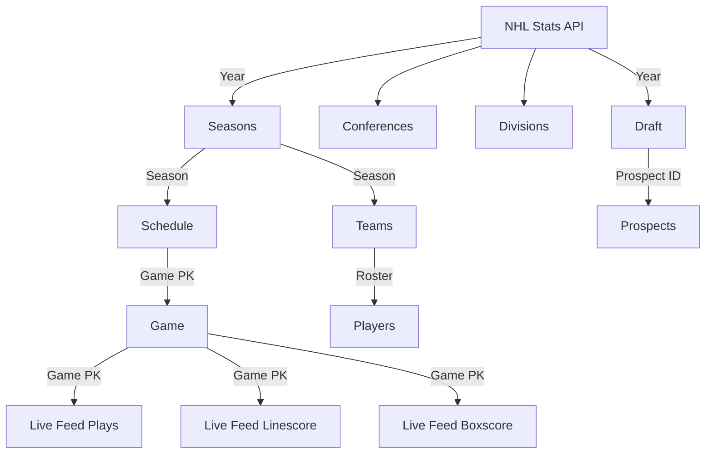

> A modern application of data-engineering and data-science on public Hockey (NHL) data for the purposes of learning & development

## Table of contents
* [Introduction](#introduction)
* [Architecture](#architecture)
* [Setup](#setup)
* [Resources](#resources)
* [Developer contact](#developer-contact)

## Introduction
---

The motivation behind this project was simple: make public hockey data available using modern technologies for the purposes of data-science & data-visualization. We wanted to be able to answer questions like...
* Which players are most likely to have a breakout season next year?
* Which draft prospects are most likely to succeed in the NHL?
* How many goals should we expect from elite players like Connor McDavid or Auston Matthews next season?
* Where on the ice are individual players most efficient with their shooting?

## Architecture

In order to get to this state of-course, a lot of data-engineering was necessary. Below is a visual representation of the project architecture.

### Data extraction

Currently, we only have a single source of data: the NHL Stats API. The Github repo that we built to extract the data is called `tap-nhl`. It is a Singer tap for the NHL Stats API.

Built with the [Meltano Tap SDK](https://sdk.meltano.com) for Singer Taps.

Below is a flow diagram explaining how it works:

Resources
* Repo: [tap-nhl](https://github.com/the-data-base/tap-nhl)

### Data transformation & loading

All of this work is contained within a Github repo called `nhl-data` and uses dbt to model our raw data. It contains the source code used to transform raw nhl data from the NHL Stats API into analysis-ready models.

In other words, this is where the SQL magic happens using dbt. Ultimately, this work converts confusing raw data into:
  * Data analyst/scientist friendly datasets all within one data warehouse (BigQuery)
  * Well-documented tables, field definitions, and queries
  * Reliable data that is tested and validated before ever making it into production

Resources
* Repo: [nhl-data](https://github.com/the-data-base/nhl-data)
* Documentation: [dbt generated documentation](https://the-data-base.github.io/nhl-data/#!/overview)

### Data science

Consider this section separate from the rest. Each question that we decide to answer of our newly modeled data will live in this bucket. For example, one of the projects that spawned from this was the [nhl-xg project](https://github.com/the-data-base/nhl-xg)

## Setup
---
TBD..

## Resources
---
- Learn more about dbt [in the docs](https://docs.getdbt.com/docs/introduction)
- Check out [Discourse](https://discourse.getdbt.com/) for commonly asked questions and answers
- Join the [chat](https://community.getdbt.com/) on Slack for live discussions and support
- Find [dbt events](https://events.getdbt.com) near you
- Check out [the blog](https://blog.getdbt.com/) for the latest news on dbt's development and best practices

## Developer contact
---
* [@gavh3](https://github.com/gavh3)
* [@dmf95](https://github.com/dmf95)
